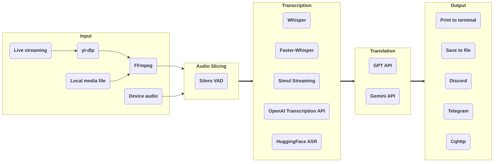

# stream-translator-gpt

[](https://badge.fury.io/py/stream-translator-gpt) [](https://pypi.org/project/stream-translator-gpt/) [](https://pepy.tech/project/stream-translator-gpt) [](https://github.com/ionic-bond/stream-translator-gpt/blob/main/LICENSE) [](https://gradio.app)

English | [中文](./README_CN.md) | [日本語](./README_JP.md)

stream-translator-gpt is a command-line tool for real-time transcription and translation of live streams. We have now added an easier-to-use WebUI entry point.

Try it on Colab: 

|                                                                                     WebUI                                                                                     |                                                                                       Command Line                                                                                        |
| :---------------------------------------------------------------------------------------------------------------------------------------------------------------------------: | :---------------------------------------------------------------------------------------------------------------------------------------------------------------------------------------: |
| [](https://colab.research.google.com/github/ionic-bond/stream-translator-gpt/blob/main/webui.ipynb) | [](https://colab.research.google.com/github/ionic-bond/stream-translator-gpt/blob/main/stream_translator.ipynb) |

(Due to frequent scraping and theft of API keys, we are unable to provide a trial API key. You need to fill in your own API key.)

## Pipeline



Uses [**yt-dlp**](https://github.com/yt-dlp/yt-dlp) to extract audio data from live streams.

Dynamic threshold audio slicing based on [**Silero-VAD**](https://github.com/snakers4/silero-vad).

Use [**Whisper**](https://github.com/openai/whisper) / [**Faster-Whisper**](https://github.com/SYSTRAN/faster-whisper) / [**Simul Streaming**](https://github.com/ufal/SimulStreaming) / [**HuggingFace ASR**](https://huggingface.co/models?pipeline_tag=automatic-speech-recognition) locally or call [**OpenAI Transcription API**](https://platform.openai.com/docs/guides/speech-to-text) remotely for transcription.

Use OpenAI's [**GPT API**](https://platform.openai.com/docs/overview) / Google's [**Gemini API**](https://ai.google.dev/gemini-api/docs) for translation.

Finally, the results can be printed to the terminal, saved to a file, or sent to a group via social media bot.

## Prerequisites

1. **Python** >= 3.10
2. **FFmpeg** (skip if already installed):
   - Windows: `winget install ffmpeg`
   - Linux (Debian/Ubuntu): `sudo apt install ffmpeg`
3. [**Install CUDA on your system**](https://developer.nvidia.com/cuda-downloads).
4. [**Install cuDNN to your CUDA dir**](https://developer.nvidia.com/cudnn-downloads) if you want to use **Faster-Whisper**.
5. [**Install PyTorch (with CUDA) to your Python**](https://pytorch.org/get-started/locally/).
6. [**Create a Google API key**](https://aistudio.google.com/app/apikey) if you want to use **Gemini API** for translation.
7. [**Create a OpenAI API key**](https://platform.openai.com/api-keys) if you want to use **OpenAI Transcription API** for transcription or **GPT API** for translation.

## Installation

### WebUI

```
pip install stream-translator-gpt[webui] -U
```

### Command Line

```
pip install stream-translator-gpt -U
```

## Usage

The commands on Colab [](https://colab.research.google.com/github/ionic-bond/stream-translator-gpt/blob/main/stream_translator.ipynb) are the recommended usage, below are some other commonly used options.

- Transcribe live streaming (default use **Whisper**):

    ```stream-translator-gpt {URL} --language {input_language}```

- Transcribe by **Faster-Whisper**:

    ```stream-translator-gpt {URL} --language {input_language} --use-faster-whisper```

- Transcribe by **SimulStreaming**:

    ```stream-translator-gpt {URL} --language {input_language} --use-simul-streaming```

- Transcribe by **SimulStreaming** with **Faster-Whisper** as the encoder:

    ```stream-translator-gpt {URL} --language {input_language} --use-simul-streaming --use-faster-whisper```

- Transcribe by **OpenAI Transcription API**:

    ```stream-translator-gpt {URL} --language {input_language} --use-openai-transcription-api --openai-api-key {your_openai_key}```

- Transcribe by a **HuggingFace ASR** model (requires `pip install stream-translator-gpt[hf_asr]`):

    ```stream-translator-gpt {URL} --model {hf_model_name} --use-hf-asr```

    Only models with `pipeline_tag: automatic-speech-recognition` on Hugging Face Hub are supported.

- Translate to other language by **Gemini**:

    ```stream-translator-gpt {URL} --language ja --translation-prompt "Translate from Japanese to Chinese" --google-api-key {your_google_key}```

- Translate to other language by **GPT**:

    ```stream-translator-gpt {URL} --language ja --translation-prompt "Translate from Japanese to Chinese" --openai-api-key {your_openai_key}```

- Using **OpenAI Transcription API** and **Gemini** at the same time:

    ```stream-translator-gpt {URL} --language ja --use-openai-transcription-api --openai-api-key {your_openai_key} --translation-prompt "Translate from Japanese to Chinese" --google-api-key {your_google_key}```

- Local video/audio file as input:

    ```stream-translator-gpt /path/to/file --language {input_language}```

- Record system audio as input:

    ```stream-translator-gpt device --language {input_language}```

- Record microphone as input:

    ```stream-translator-gpt device --language {input_language} --mic```

- Sending result to Discord:

    ```stream-translator-gpt {URL} --language {input_language} --discord-webhook-url {your_discord_webhook_url}```

- Sending result to Telegram:

    ```stream-translator-gpt {URL} --language {input_language} --telegram-token {your_telegram_token} --telegram-chat-id {your_telegram_chat_id}```

- Sending result to Cqhttp:

    ```stream-translator-gpt {URL} --language {input_language} --cqhttp-url {your_cqhttp_url} --cqhttp-token {your_cqhttp_token}```

- Saving result to a .srt subtitle file:

    ```stream-translator-gpt {URL} --language ja --translation-prompt "Translate from Japanese to Chinese" --google-api-key {your_google_key} --no-show-transcribe-result --retry-if-translation-fails --output-timestamps --output-file-path ./result.srt```

### All options

```stream-translator-gpt URL [OPTIONS]```

> [!NOTE]
> All options accept both hyphens and underscores: `--openai-api-key` and `--openai_api_key` are equivalent.
> Every boolean option has an inverse `--no-*` form that turns it off (e.g. `--no-dynamic-vad-threshold` disables `--dynamic-vad-threshold`, which is on by default).

| Option                                  | Default Value                  | Description                                                                                                                                                                                                        |
| :-------------------------------------- | :----------------------------- | :----------------------------------------------------------------------------------------------------------------------------------------------------------------------------------------------------------------- |
| `URL`                                   |                                | The URL of the stream. If a local file path is filled in, it will be used as input. If fill in "device", the input will be obtained from your PC device.                                                           |
| **Overall Options**                     |
| `--openai-api-key`                      |                                | OpenAI API key if using GPT translation / Whisper API. If you have multiple keys, you can separate them with "," and each key will be used in turn.                                                                |
| `--google-api-key`                      |                                | Google API key if using Gemini translation. If you have multiple keys, you can separate them with "," and each key will be used in turn.                                                                           |
| `--openai-base-url`                     |                                | Customize the API endpoint of OpenAI (Affects GPT translation & OpenAI Transcription).                                                                                                                             |
| `--google-base-url`                     |                                | Customize the API endpoint of Google (Affects Gemini translation).                                                                                                                                                 |
| `--no-verify-ssl`                       |                                | Disable TLS certificate verification for OpenAI / Google API and HuggingFace downloads. Use this when your API endpoint or proxy has a self-signed or invalid certificate. If the base URL host is a bare IP, verification is disabled automatically. |
| `--proxy`                               |                                | Used to set the proxy for all --*-proxy flags if they are not specifically set. Also sets http_proxy environment variables.                                                                                        |
| **Input Options**                       |
| `--format`                              | ba/wa*                         | Stream format code, this parameter will be passed directly to yt-dlp. You can get the list of available format codes by `yt-dlp {url} -F`                                                                          |
| `--list-format`                         |                                | Print all available formats then exit.                                                                                                                                                                             |
| `--cookies`                             |                                | Used to open member-only stream, this parameter will be passed directly to yt-dlp.                                                                                                                                 |
| `--input-proxy`                         |                                | Use the specified HTTP/HTTPS/SOCKS proxy for yt-dlp, e.g. http://127.0.0.1:7890.                                                                                                                                   |
| `--device-index`                        |                                | The index of the device that needs to be recorded. If not set, the system default recording device will be used.                                                                                                   |
| `--list-devices`                        |                                | Print all audio devices info then exit.                                                                                                                                                                            |
| `--device-recording-interval`           | 0.5                            | The shorter the recording interval, the lower the latency, but it will increase CPU usage. It is recommended to set it between 0.1 and 1.0.                                                                        |
| **Audio Slicing Options**               |
| `--min-audio-length`                    | 0.5                            | Minimum slice audio length in seconds.                                                                                                                                                                             |
| `--max-audio-length`                    | 30.0                           | Maximum slice audio length in seconds.                                                                                                                                                                             |
| `--target-audio-length`                 | 5.0                            | When dynamic no speech threshold is enabled (enabled by default), the program will slice the audio as close to this length as possible.                                                                            |
| `--continuous-no-speech-threshold`      | 1.0                            | Slice if there is no speech during this number of seconds. If the dynamic no speech threshold is enabled (enabled by default), the actual threshold will be dynamically adjusted based on this value.              |
| `--no-dynamic-no-speech-threshold` |                                | Disable dynamic no speech threshold (enabled by default).                                                                                                                                                              |
| `--prefix-retention-length`             | 0.5                            | The length of the retention prefix audio during slicing.                                                                                                                                                           |
| `--vad-threshold`                       | 0.35                           | Range 0~1. the higher this value, the stricter the speech judgment. If dynamic VAD threshold is enabled (enabled by default), this threshold will be adjusted dynamically based on the input speech's VAD results. |
| `--no-dynamic-vad-threshold`       |                                | Disable dynamic VAD threshold (enabled by default).                                                                                                                                                                    |
| **Transcription Options**               |
| `--model`                               | turbo                          | Select Whisper/Faster-Whisper/Simul Streaming model size. See [here](https://github.com/openai/whisper#available-models-and-languages) for available models.                                                       |
| `--language`                            | auto                           | Language spoken in the stream. See [here](https://github.com/openai/whisper#available-models-and-languages) for available languages.                                                                               |
| `--use-faster-whisper`                  |                                | Set this flag to use Faster-Whisper instead of Whisper. If used with --use-simul-streaming, SimulStreaming with Faster-Whisper as the encoder will be used.                                                        |
| `--use-simul-streaming`                 |                                | Set this flag to use SimulStreaming instead of Whisper. If used with --use-faster-whisper, SimulStreaming with Faster-Whisper as the encoder will be used.                                                         |
| `--use-openai-transcription-api`        |                                | Set this flag to use OpenAI transcription API instead of the original local Whipser.                                                                                                                               |
| `--use-hf-asr`                          |                                | Set this flag to use a HuggingFace ASR model. Use `--model` to specify the model ID. Requires `pip install stream-translator-gpt[hf_asr]`.                                                                         |
| `--transcription-filters`               | emoji_filter,repetition_filter | Filters apply to transcription results, separated by ",". We provide emoji_filter and repetition_filter.                                               |
| `--no-language-based-filter`       |                                | Disable the currently provided English, Chinese, and Japanese language filters based on ASR language (enabled by default).                               |
| `--transcription-initial-prompt`        |                                | General purpose prompt/glossary for transcription. Format: "Word1, Word2, Word3, ...". This text is always included in the prompt passed to the model.                                                             |
| `--no-transcription-context`       |                                | Disable context (previous sentence) propagation in transcription (enabled by default).                                                                                                                                 |
| **Translation Options**                 |
| `--gpt-model`                           | gpt-5.4-nano                   | OpenAI's GPT model name, gpt-5.4 / gpt-5.4-mini / gpt-5.4-nano / gpt-5.5 / gpt-5.6-luna                                                                                                                            |
| `--gemini-model`                        | gemini-3.5-flash-lite          | Google's Gemini model name, gemini-3-flash-preview / gemini-3.1-flash-lite / gemini-3.5-flash / gemini-3.5-flash-lite / gemini-3.6-flash |
| `--translation-prompt`                  |                                | If set, will translate the result text to target language via GPT / Gemini API (According to which API key is filled in). Example: "Translate from Japanese to Chinese"                                            |
| `--translation-history-size`            | 0                              | The number of previous transcripts sent as context when calling the LLM API. It is recommended to disable context (set to 0) for weaker models.                                                                    |
| `--translation-timeout`                 | 10                             | If the GPT / Gemini translation exceeds this number of seconds, the translation will be discarded.                                                                                                                 |
| `--use-json-result`                     |                                | Using JSON result in LLM translation for some locally deployed models.                                                                                                                                             |
| `--retry-if-translation-fails`          |                                | Retry when translation times out/fails. Used to generate subtitles offline.                                                                                                                                        |
| `--temperature`                         |                                | GPT/Gemini parameter. Controls output randomness, higher values produce more diverse results.                                                                                                                      |
| `--top-p`                               |                                | GPT/Gemini parameter. Nucleus sampling threshold, only tokens with cumulative probability above this value are considered.                                                                                         |
| `--top-k`                               |                                | Gemini parameter. Limits token selection to the top K most probable candidates.                                                                                                                                    |
| `--prompt-cache-key`                    |                                | GPT parameter. If set, enables prompt caching optimization on the API side.                                                                                                                                        |
| `--reasoning-effort`                    |                                | GPT parameter. Controls reasoning depth for reasoning models. Options: none / minimal / low / medium / high / xhigh.                                                                                               |
| `--verbosity`                           |                                | GPT parameter. Controls the verbosity of the response. Options: auto / short / concise / detailed.                                                                                                                 |
| `--service-tier`                        |                                | GPT parameter. Specifies processing priority tier. Options: auto / default / flex / priority.                                                                                                                      |
| `--debug-mode`                          |                                | Enable debug mode. Print messages sent to LLM and usage info after each translation call.                                                                                                                          |
| `--processing-proxy`                    |                                | Use the specified HTTP/HTTPS/SOCKS proxy for Whisper/GPT API (Gemini currently doesn't support specifying a proxy within the program), e.g. http://127.0.0.1:7890.                                                 |
| **Output Options**                      |
| `--output-timestamps`                   |                                | Output the timestamp of the text when outputting the text.                                                                                                                                                         |
| `--no-show-transcribe-result`              |                                | Hide the result of Whisper transcribe (shown by default).                                                                                                                                                                             |
| `--output-file-path`                    |                                | If set, will save the result text to this path.                                                                                                                                                                    |
| `--cqhttp-url`                          |                                | If set, will send the result text to the cqhttp server.                                                                                                                                                            |
| `--cqhttp-token`                        |                                | Token of cqhttp, if it is not set on the server side, it does not need to fill in.                                                                                                                                 |
| `--discord-webhook-url`                 |                                | If set, will send the result text to the discord channel.                                                                                                                                                          |
| `--telegram-token`                      |                                | Token of Telegram bot.                                                                                                                                                                                             |
| `--telegram-chat-id`                    |                                | If set, will send the result text to this Telegram chat. Needs to be used with \"--telegram-token\".                                                                                                               |
| `--output-proxy`                        |                                | Use the specified HTTP/HTTPS/SOCKS proxy for Cqhttp/Discord/Telegram, e.g. http://127.0.0.1:7890.                                                                                                                  |

## Contact me

Telegram: [@ionic_bond](https://t.me/ionic_bond)

## Donate

[PayPal Donate](https://www.paypal.com/donate/?hosted_button_id=D5DRBK9BL6DUA) or [PayPal](https://paypal.me/ionicbond3)
