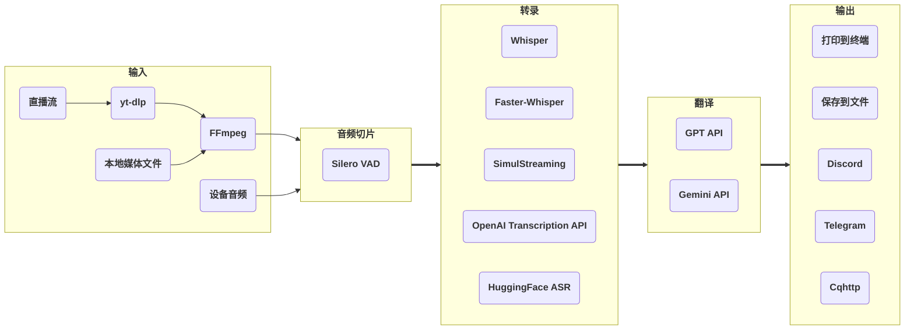

# stream-translator-gpt

[](https://badge.fury.io/py/stream-translator-gpt) [](https://pypi.org/project/stream-translator-gpt/) [](https://pepy.tech/project/stream-translator-gpt) [](https://github.com/ionic-bond/stream-translator-gpt/blob/main/LICENSE) [](https://gradio.app)

[English](./README.md) | 中文 | [日本語](./README_JP.md)

对直播流、本地媒体文件和设备音频进行实时转录和翻译。提供命令行工具和 Gradio WebUI 两种使用方式。

## 在 Colab 上快速开始（推荐）

最简单的使用方式：无需搭建本地环境，Colab 的性能足以稳定地日常使用，你只需要按用途准备自己的 API key：

- 使用 **Gemini API** 翻译：[创建 **Google API key**](https://aistudio.google.com/app/apikey)（推荐，Gemini 的 **Flash-Lite** 模型有每分钟 15 条、每日 500 条的免费额度）
- 使用 **OpenAI Transcription API** 转录或 **GPT API** 翻译：[创建 **OpenAI API key**](https://platform.openai.com/api-keys)（也可以使用任何 **OpenAI 兼容格式**的 API）

|                                                                                          命令行                                                                                           |                                                                                     WebUI                                                                                     |
| :---------------------------------------------------------------------------------------------------------------------------------------------------------------------------------------: | :---------------------------------------------------------------------------------------------------------------------------------------------------------------------------: |
| [](https://colab.research.google.com/github/ionic-bond/stream-translator-gpt/blob/main/stream_translator.ipynb) | [](https://colab.research.google.com/github/ionic-bond/stream-translator-gpt/blob/main/webui.ipynb) |

> [!NOTE]
> 由于 API key 被频繁爬取和盗用，我们无法提供试用 API key，请填写你自己的 API key。

## 工作原理



- **输入**：[**yt-dlp**](https://github.com/yt-dlp/yt-dlp) 从直播流中提取音频；也支持本地媒体文件和电脑设备音频。
- **音频切片**：基于 [**Silero-VAD**](https://github.com/snakers4/silero-vad) 的动态阈值切片。
- **转录**：本地使用 [**Whisper**](https://github.com/openai/whisper) / [**Faster-Whisper**](https://github.com/SYSTRAN/faster-whisper) / [**SimulStreaming**](https://github.com/ufal/SimulStreaming) / [**HuggingFace ASR**](https://huggingface.co/models?pipeline_tag=automatic-speech-recognition)，或远程调用 [**OpenAI Transcription API**](https://platform.openai.com/docs/guides/speech-to-text)。
- **翻译**（可选）：OpenAI 的 [**GPT API**](https://platform.openai.com/docs/overview) 或 Google 的 [**Gemini API**](https://ai.google.dev/gemini-api/docs)。
- **输出**：打印到**终端**、保存到**文件**（如 **.srt** 字幕），或发送到 **Discord** / **Telegram** / **Cqhttp**。

## 本地安装（进阶）

本地运行需要一定的 Python 环境经验（Windows 下尤其如此），你实际上是在自己搭建一个与 Colab 类似的环境。拿不准的话，建议直接用 Colab。

1. **Python** >= 3.10
2. **FFmpeg**（已安装可跳过）：
   - Windows: `winget install ffmpeg`
   - Linux (Debian/Ubuntu): `sudo apt install ffmpeg`
3. 如需**本地转录**（Whisper / Faster-Whisper / SimulStreaming / HuggingFace ASR）时安装，只用 OpenAI Transcription API 的话不需要：
   - [在系统上安装 **CUDA**](https://developer.nvidia.com/cuda-downloads)
   - [为 Python 安装 **PyTorch**（CUDA 版）](https://pytorch.org/get-started/locally/)
   - 如需使用 **Faster-Whisper**，[将 **cuDNN** 安装到 CUDA 目录](https://developer.nvidia.com/cudnn-downloads)

然后安装：

```
pip install stream-translator-gpt -U
```

或连同 WebUI 一起安装：

```
pip install stream-translator-gpt[webui] -U
```

## 使用方法

### WebUI

```
stream-translator-gpt-webui
```

然后在浏览器中打开输出的本地链接。CLI 的全部功能都可以在界面中使用，配置还可以保存为预设。

### 命令行

```
stream-translator-gpt URL [OPTIONS]
```

**转录后端**（默认使用本地 **Whisper**）：

- ```stream-translator-gpt {网址} --language {输入语言}```
- **Faster-Whisper**: ```stream-translator-gpt {网址} --language {输入语言} --use-faster-whisper```
- **SimulStreaming**: ```stream-translator-gpt {网址} --language {输入语言} --use-simul-streaming```
- 以 **Faster-Whisper** 为编码器的 **SimulStreaming**: ```stream-translator-gpt {网址} --language {输入语言} --use-simul-streaming --use-faster-whisper```
- **OpenAI Transcription API**: ```stream-translator-gpt {网址} --language {输入语言} --use-openai-transcription-api --openai-api-key {你的 OpenAI key}```
- **HuggingFace ASR** 模型（需要 `pip install stream-translator-gpt[hf_asr]`；仅支持 Hugging Face Hub 上 `pipeline_tag` 为 `automatic-speech-recognition` 的模型）: ```stream-translator-gpt {网址} --model {hf_模型名} --use-hf-asr```

**翻译**（设置 `--translation-prompt` 即启用；根据填写的 API key 自动选择服务商）：

- 使用 **Gemini**: ```stream-translator-gpt {网址} --language {输入语言} --translation-prompt "把{输入语言}翻译成{输出语言}" --google-api-key {你的 Google key}```
- 使用 **GPT**: ```stream-translator-gpt {网址} --language {输入语言} --translation-prompt "把{输入语言}翻译成{输出语言}" --openai-api-key {你的 OpenAI key}```
- 同时使用 **OpenAI Transcription API** 和 **Gemini**: ```stream-translator-gpt {网址} --language {输入语言} --use-openai-transcription-api --openai-api-key {你的 OpenAI key} --translation-prompt "把{输入语言}翻译成{输出语言}" --google-api-key {你的 Google key}```

> [!TIP]
> 翻译 prompt 会原样传给大模型，所以它能承载的不只是语言对。如果你的 API 额度允许，把背景信息写进去（主播是谁、直播的内容是什么、专有名词希望怎么译等），翻译会更准确，也更能根据上下文纠正语音识别的错字。

**输入源**（除直播流网址外）：

- 本地视频/音频文件: ```stream-translator-gpt {文件路径} --language {输入语言}```
- 系统音频（即电脑正在播放的声音）: ```stream-translator-gpt device --language {输入语言}```
- 麦克风: ```stream-translator-gpt device --mic --language {输入语言}```

**输出目标**（除终端外）：

- Discord: ```stream-translator-gpt {网址} --language {输入语言} --discord-webhook-url {你的 Discord webhook 地址}```
- Telegram: ```stream-translator-gpt {网址} --language {输入语言} --telegram-token {你的 Telegram 令牌} --telegram-chat-id {你的 Telegram 聊天 id}```
- Cqhttp: ```stream-translator-gpt {网址} --language {输入语言} --cqhttp-url {你的 Cqhttp 地址} --cqhttp-token {你的 Cqhttp 令牌}```
- .srt 字幕文件（离线生成）: ```stream-translator-gpt {网址} --language {输入语言} --translation-prompt "把{输入语言}翻译成{输出语言}" --google-api-key {你的 Google key} --no-show-transcribe-result --retry-if-translation-fails --output-timestamps --output-file-path ./result.srt```

## 所有选项

> [!NOTE]
> 所有选项的横杠和下划线写法等价：`--openai-api-key` 与 `--openai_api_key` 相同。
> 每个布尔选项都有对应的 `--no-*` 反向形式用于关闭（例如默认开启的 `--dynamic-vad-threshold` 可以用 `--no-dynamic-vad-threshold` 关闭）。

| 选项                               | 默认值                         | 描述                                                                                                                                                                          |
| :--------------------------------- | :----------------------------- | :---------------------------------------------------------------------------------------------------------------------------------------------------------------------------- |
| `URL`                              |                                | 直播流的 URL。如果填入本地文件路径，则会将其用作输入。如果填入 "device"，将从你的电脑设备获取输入。                                                                           |
| **通用选项**                       |
| `--openai-api-key`                 |                                | 使用 GPT 翻译 / OpenAI Transcription API 时需要的 OpenAI API key。如果有多个 key，可用 "," 分隔，每个 key 会轮流使用。                                                        |
| `--google-api-key`                 |                                | 使用 Gemini 翻译时需要的 Google API key。如果有多个 key，可用 "," 分隔，每个 key 会轮流使用。                                                                                 |
| `--openai-base-url`                |                                | 自定义 OpenAI 的 API 端点（影响 GPT 翻译和 OpenAI 转录）。                                                                                                                    |
| `--google-base-url`                |                                | 自定义 Google 的 API 端点（影响 Gemini 翻译）。                                                                                                                               |
| `--no-verify-ssl`                  |                                | 禁用 OpenAI / Google API 及 HuggingFace 下载的 TLS 证书校验。当你的 API 端点或代理使用自签名或无效证书时使用。如果 base URL 的主机是裸 IP，会自动禁用校验。                   |
| `--proxy`                          |                                | 为所有未单独设置的 --*-proxy 选项统一设置代理。同时会设置 http_proxy 环境变量。                                                                                               |
| **输入选项**                       |
| `--format`                         | ba/wa*                         | 流格式代码，此参数会直接传给 yt-dlp。可通过 `yt-dlp {url} -F` 获取可用格式列表。                                                                                              |
| `--list-format`                    |                                | 打印所有可用格式后退出。                                                                                                                                                      |
| `--cookies`                        |                                | 用于打开会员限定直播，此参数会直接传给 yt-dlp。                                                                                                                               |
| `--input-proxy`                    |                                | 为 yt-dlp 指定 HTTP/HTTPS/SOCKS 代理，例如 http://127.0.0.1:7890。                                                                                                            |
| `--device-index`                   |                                | 需要录制的设备编号。不设置时使用系统默认录音设备。                                                                                                                            |
| `--list-devices`                   |                                | 打印所有音频设备信息后退出。                                                                                                                                                  |
| `--device-recording-interval`      | 0.5                            | 录制间隔越短延迟越低，但会增加 CPU 占用。建议设置在 0.1 到 1.0 之间。                                                                                                         |
| `--mic`                            |                                | 使用麦克风代替系统音频（电脑正在播放的声音）作为输入。                                                                                                                        |
| **音频切片选项**                   |
| `--min-audio-length`               | 0.5                            | 音频切片的最小长度（秒）。                                                                                                                                                    |
| `--max-audio-length`               | 30.0                           | 音频切片的最大长度（秒）。                                                                                                                                                    |
| `--target-audio-length`            | 5.0                            | 启用动态静音阈值时（默认开启），程序会尽量将音频切成接近此长度的片段。                                                                                                        |
| `--continuous-no-speech-threshold` | 1.0                            | 持续无语音达到此秒数时切片。启用动态静音阈值时（默认开启），实际阈值会基于此值动态调整。                                                                                      |
| `--no-dynamic-no-speech-threshold` |                                | 禁用动态静音阈值（默认开启）。                                                                                                                                                |
| `--prefix-retention-length`        | 0.5                            | 切片时保留的前缀音频长度。                                                                                                                                                    |
| `--vad-threshold`                  | 0.35                           | 范围 0~1。此值越高，语音判定越严格。启用动态 VAD 阈值时（默认开启），阈值会基于此值动态调整。                                                                                 |
| `--no-dynamic-vad-threshold`       |                                | 禁用动态 VAD 阈值（默认开启）。                                                                                                                                               |
| **转录选项**                       |
| `--model`                          | turbo                          | 选择 Whisper/Faster-Whisper/SimulStreaming 的模型大小。可用模型参见[此处](https://github.com/openai/whisper#available-models-and-languages)。                                 |
| `--language`                       | auto                           | 直播中使用的语言。默认自动检测。可用语言参见[此处](https://github.com/openai/whisper#available-models-and-languages)。                                                        |
| `--use-faster-whisper`             |                                | 使用 Faster-Whisper 代替 Whisper。与 --use-simul-streaming 同时使用时，将以 Faster-Whisper 为编码器运行 SimulStreaming。                                                      |
| `--use-simul-streaming`            |                                | 使用 SimulStreaming 代替 Whisper。与 --use-faster-whisper 同时使用时，将以 Faster-Whisper 为编码器运行 SimulStreaming。                                                       |
| `--use-openai-transcription-api`   |                                | 使用 OpenAI Transcription API 代替本地 Whisper。                                                                                                                              |
| `--use-hf-asr`                     |                                | 使用 HuggingFace ASR 模型，用 `--model` 指定模型 ID。需要 `pip install stream-translator-gpt[hf_asr]`。                                                                       |
| `--transcription-filters`          | emoji_filter,repetition_filter | 应用于转录结果的过滤器，用 "," 分隔。目前提供 emoji_filter 和 repetition_filter。                                                                                             |
| `--no-language-based-filter`       |                                | 禁用根据 ASR 语言自动挂载的语言过滤器（默认开启）。目前提供英文、中文和日文的过滤器。                                                                                         |
| `--transcription-initial-prompt`   |                                | 转录用的通用 prompt 或术语表。格式："词1, 词2, 词3, ..."。该文本会始终包含在传给模型的 prompt 中。                                                                            |
| `--no-transcription-context`       |                                | 禁用转录中的上下文（上一句）传递（默认开启）。                                                                                                                                |
| **翻译选项**                       |
| `--gpt-model`                      | gpt-5.4-nano                   | OpenAI 的 GPT 模型名，gpt-5.4 / gpt-5.4-mini / gpt-5.4-nano / gpt-5.5 / gpt-5.6-luna                                                                                          |
| `--gemini-model`                   | gemini-3.5-flash-lite          | Google 的 Gemini 模型名，gemini-3-flash-preview / gemini-3.1-flash-lite / gemini-3.5-flash / gemini-3.5-flash-lite / gemini-3.6-flash                                         |
| `--translation-prompt`             |                                | 设置后，将通过 GPT / Gemini API 把结果文本翻译为目标语言（根据填写的 API key 自动选择）。示例："将日语翻译为中文"。在 prompt 中补充背景（主播是谁、直播内容）可提升翻译质量。 |
| `--translation-history-size`       | 0                              | 调用 LLM API 时作为上下文发送的历史转录条数。对较弱的模型建议禁用上下文（设为 0）。                                                                                           |
| `--translation-timeout`            | 10                             | GPT / Gemini 翻译超过此秒数时，该条翻译将被丢弃。                                                                                                                             |
| `--use-json-result`                |                                | 在 LLM 翻译中使用 JSON 结果，适用于某些本地部署的模型。                                                                                                                       |
| `--retry-if-translation-fails`     |                                | 翻译超时/失败时重试。用于离线生成字幕。                                                                                                                                       |
| `--temperature`                    |                                | GPT/Gemini 参数。控制输出随机性，值越高结果越多样。                                                                                                                           |
| `--top-p`                          |                                | GPT/Gemini 参数。核采样阈值，只考虑累计概率超过此值的 token。                                                                                                                 |
| `--top-k`                          |                                | Gemini 参数。将 token 选择限制在概率最高的 K 个候选之内。                                                                                                                     |
| `--prompt-cache-key`               |                                | GPT 参数。设置后在 API 侧启用 prompt 缓存优化。                                                                                                                               |
| `--reasoning-effort`               |                                | GPT 参数。控制推理模型的推理深度。可选：none / minimal / low / medium / high / xhigh。                                                                                        |
| `--verbosity`                      |                                | GPT 参数。控制回复的详细程度。可选：auto / short / concise / detailed。                                                                                                       |
| `--service-tier`                   |                                | GPT 参数。指定处理优先级层级。可选：auto / default / flex / priority。                                                                                                        |
| `--debug-mode`                     |                                | 启用调试模式。每次翻译调用后打印发送给 LLM 的消息和用量信息。                                                                                                                 |
| `--processing-proxy`               |                                | 为 Whisper/GPT API 指定 HTTP/HTTPS/SOCKS 代理（Gemini 目前不支持在程序内指定代理），例如 http://127.0.0.1:7890。                                                              |
| **输出选项**                       |
| `--output-timestamps`              |                                | 输出文本时附带时间戳。                                                                                                                                                        |
| `--no-show-transcribe-result`      |                                | 隐藏转录结果（默认显示）。                                                                                                                                                    |
| `--output-file-path`               |                                | 设置后，结果文本将保存到此路径。                                                                                                                                              |
| `--cqhttp-url`                     |                                | 设置后，结果文本将发送到此 Cqhttp 服务器。                                                                                                                                    |
| `--cqhttp-token`                   |                                | Cqhttp 的 Token，服务器端未设置的话无需填写。                                                                                                                                 |
| `--discord-webhook-url`            |                                | 设置后，结果文本将发送到此 Discord 频道。                                                                                                                                     |
| `--telegram-token`                 |                                | Telegram 机器人的 Token。                                                                                                                                                     |
| `--telegram-chat-id`               |                                | 设置后，结果文本将发送到此 Telegram 聊天。需要与 --telegram-token 配合使用。                                                                                                  |
| `--output-proxy`                   |                                | 为 Cqhttp/Discord/Telegram 指定 HTTP/HTTPS/SOCKS 代理，例如 http://127.0.0.1:7890。                                                                                           |

## 联系我

Telegram: [@ionic_bond](https://t.me/ionic_bond)

## 捐赠

[PayPal 捐赠](https://www.paypal.com/donate/?hosted_button_id=D5DRBK9BL6DUA) 或 [PayPal](https://paypal.me/ionicbond3)
