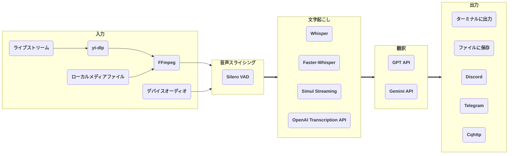

# stream-translator-gpt

[](https://badge.fury.io/py/stream-translator-gpt) [](https://pypi.org/project/stream-translator-gpt/) [](https://pepy.tech/project/stream-translator-gpt) [](https://github.com/ionic-bond/stream-translator-gpt/blob/main/LICENSE) [](https://gradio.app)

[English](./README.md) | [中文](./README_CN.md) | 日本語

stream-translator-gpt は、ライブストリームのリアルタイム文字起こしと翻訳を行うコマンドラインツールです。より使いやすい WebUI エントリーポイントも追加されました。

Colab で試す：

|                                                                                     WebUI                                                                                     |                                                                                      コマンドライン                                                                                       |
| :---------------------------------------------------------------------------------------------------------------------------------------------------------------------------: | :---------------------------------------------------------------------------------------------------------------------------------------------------------------------------------------: |
| [](https://colab.research.google.com/github/ionic-bond/stream-translator-gpt/blob/main/webui.ipynb) | [](https://colab.research.google.com/github/ionic-bond/stream-translator-gpt/blob/main/stream_translator.ipynb) |

（API キーの頻繁なスクレイピングと盗用のため、試用の API キーを提供できません。ご自身の API キーをご記入ください。）

## パイプライン



[**yt-dlp**](https://github.com/yt-dlp/yt-dlp) を使用してライブストリームから音声データを抽出します。

[**Silero-VAD**](https://github.com/snakers4/silero-vad) に基づく動的しきい値による音声スライシングを行います。

ローカルで [**Whisper**](https://github.com/openai/whisper) / [**Faster-Whisper**](https://github.com/SYSTRAN/faster-whisper) / [**Simul Streaming**](https://github.com/ufal/SimulStreaming) を使用するか、リモートで [**OpenAI Transcription API**](https://platform.openai.com/docs/guides/speech-to-text) を呼び出して文字起こしを行います。

OpenAI の [**GPT API**](https://platform.openai.com/docs/overview) / Google の [**Gemini API**](https://ai.google.dev/gemini-api/docs) を使用して翻訳を行います。

最後に、結果はターミナルに出力、ファイルに保存、またはソーシャルメディアボットを通じてグループに送信できます。

## 前提条件

1. **Python** >= 3.8（推奨 >= 3.10）
2. **FFmpeg**（既にインストール済みの場合はスキップ）：
   - Windows: `winget install ffmpeg`
   - Linux (Debian/Ubuntu): `sudo apt install ffmpeg`
3. [**システムに CUDA をインストール**](https://developer.nvidia.com/cuda-downloads)してください。
4. **Faster-Whisper** を使用する場合は、[**cuDNN を CUDA ディレクトリにインストール**](https://developer.nvidia.com/cudnn-downloads)してください。
5. [**Python に PyTorch（CUDA 版）をインストール**](https://pytorch.org/get-started/locally/)してください。
6. **Gemini API** で翻訳する場合は、[**Google API キーを作成**](https://aistudio.google.com/app/apikey)してください。
7. **OpenAI Transcription API** で文字起こし、または **GPT API** で翻訳する場合は、[**OpenAI API キーを作成**](https://platform.openai.com/api-keys)してください。

## WebUI

```
pip install stream-translator-gpt[webui] -U
stream-translator-gpt-webui
```

## コマンドライン

**PyPI からリリース版をインストール：**

```
pip install stream-translator-gpt -U
stream-translator-gpt
```

または

**Github からマスター版コードをクローン：**

```
git clone https://github.com/ionic-bond/stream-translator-gpt.git
pip install -r ./stream-translator-gpt/requirements.txt -U
python3 ./stream-translator-gpt/stream_translator_gpt/main.py
```

### 使い方

Colab 上のコマンド [](https://colab.research.google.com/github/ionic-bond/stream-translator-gpt/blob/main/stream_translator.ipynb) が推奨される使い方です。以下はその他のよく使われるオプションです。

- ライブストリームの文字起こし（デフォルトで **Whisper** を使用）：

    ```stream-translator-gpt {URL} --language {入力言語}```

- **Faster-Whisper** で文字起こし：

    ```stream-translator-gpt {URL} --language {入力言語} --use_faster_whisper```

- **SimulStreaming** で文字起こし：

    ```stream-translator-gpt {URL} --language {入力言語} --use_simul_streaming```

- **Faster-Whisper** をエンコーダーとする **SimulStreaming** で文字起こし：

    ```stream-translator-gpt {URL} --language {入力言語} --use_simul_streaming --use_faster_whisper```

- **OpenAI Transcription API** で文字起こし：

    ```stream-translator-gpt {URL} --language {入力言語} --use_openai_transcription_api --openai_api_key {your_openai_key}```

- **HuggingFace ASR** モデルで文字起こし（事前に `pip install stream-translator-gpt[hf_asr]` が必要）：

    ```stream-translator-gpt {URL} --model {hf_model_name} --use_hf_asr```

    Hugging Face Hub で `pipeline_tag` が `automatic-speech-recognition` のモデルのみサポートされています。

- **Gemini** で他の言語に翻訳：

    ```stream-translator-gpt {URL} --language ja --translation_prompt "Translate from Japanese to English" --google_api_key {your_google_key}```

- **GPT** で他の言語に翻訳：

    ```stream-translator-gpt {URL} --language ja --translation_prompt "Translate from Japanese to English" --openai_api_key {your_openai_key}```

- **OpenAI Transcription API** と **Gemini** を同時に使用：

    ```stream-translator-gpt {URL} --language ja --use_openai_transcription_api --openai_api_key {your_openai_key} --translation_prompt "Translate from Japanese to English" --google_api_key {your_google_key}```

- ローカル動画/音声ファイルを入力として使用：

    ```stream-translator-gpt /path/to/file --language {入力言語}```

- システム音声を録音して入力：

    ```stream-translator-gpt device --language {入力言語}```

- マイクを録音して入力：

    ```stream-translator-gpt device --language {入力言語} --mic```

- 結果を Discord に送信：

    ```stream-translator-gpt {URL} --language {入力言語} --discord_webhook_url {your_discord_webhook_url}```

- 結果を Telegram に送信：

    ```stream-translator-gpt {URL} --language {入力言語} --telegram_token {your_telegram_token} --telegram_chat_id {your_telegram_chat_id}```

- 結果を Cqhttp に送信：

    ```stream-translator-gpt {URL} --language {入力言語} --cqhttp_url {your_cqhttp_url} --cqhttp_token {your_cqhttp_token}```

- 結果を .srt 字幕ファイルに保存：

    ```stream-translator-gpt {URL} --language ja --translation_prompt "Translate from Japanese to English" --google_api_key {your_google_key} --hide_transcribe_result --retry_if_translation_fails --output_timestamps --output_file_path ./result.srt```

### すべてのオプション

| オプション                              | デフォルト値                   | 説明                                                                                                                                                                  |
| :-------------------------------------- | :----------------------------- | :-------------------------------------------------------------------------------------------------------------------------------------------------------------------- |
| **全般オプション**                      |
| `--openai_api_key`                      |                                | GPT 翻訳 / Whisper API を使用する場合に必要な OpenAI API キー。複数のキーがある場合は「,」で区切ると、各キーが順番に使用されます。                                    |
| `--google_api_key`                      |                                | Gemini 翻訳を使用する場合に必要な Google API キー。複数のキーがある場合は「,」で区切ると、各キーが順番に使用されます。                                                |
| `--openai_base_url`                     |                                | OpenAI の API エンドポイントをカスタマイズ（GPT 翻訳と OpenAI 文字起こしに影響）。                                                                                    |
| `--google_base_url`                     |                                | Google の API エンドポイントをカスタマイズ（Gemini 翻訳に影響）。                                                                                                     |
| `--proxy`                               |                                | 個別に設定されていないすべての --*_proxy の値を設定します。http_proxy 等の環境変数も設定します。                                                                      |
| **入力オプション**                      |                                |                                                                                                                                                                       |
| `URL`                                   |                                | ストリームの URL。ローカルファイルパスを入力すると、そのファイルが入力として使用されます。「device」と入力すると、PC デバイスから入力を取得します。                   |
| `--format`                              | ba/wa*                         | ストリーム形式コード。このパラメータは yt-dlp に直接渡されます。`yt-dlp {url} -F` で利用可能な形式コードの一覧を取得できます。                                        |
| `--list_format`                         |                                | 利用可能なすべての形式を表示して終了します。                                                                                                                          |
| `--cookies`                             |                                | メンバー限定ストリームを開くために使用します。このパラメータは yt-dlp に直接渡されます。                                                                              |
| `--input_proxy`                         |                                | yt-dlp 用の HTTP/HTTPS/SOCKS プロキシを指定します（例：http://127.0.0.1:7890）。                                                                                      |
| `--device_index`                        |                                | 録音するデバイスのインデックス。未設定の場合、システムデフォルトの録音デバイスが使用されます。                                                                        |
| `--list_devices`                        |                                | すべてのオーディオデバイス情報を表示して終了します。                                                                                                                  |
| `--device_recording_interval`           | 0.5                            | 録音間隔が短いほど遅延は低くなりますが、CPU 使用率が上がります。0.1〜1.0 の間に設定することを推奨します。                                                             |
| **音声スライシングオプション**          |                                |                                                                                                                                                                       |
| `--min_audio_length`                    | 0.5                            | 最小スライス音声長（秒）。                                                                                                                                            |
| `--max_audio_length`                    | 30.0                           | 最大スライス音声長（秒）。                                                                                                                                            |
| `--target_audio_length`                 | 5.0                            | 動的無音しきい値が有効な場合（デフォルトで有効）、プログラムはこの長さにできるだけ近づけて音声をスライスします。                                                      |
| `--continuous_no_speech_threshold`      | 1.0                            | この秒数の間に音声がない場合にスライスします。動的無音しきい値が有効な場合（デフォルトで有効）、実際のしきい値はこの値に基づいて動的に調整されます。                  |
| `--disable_dynamic_no_speech_threshold` |                                | このフラグを設定して動的無音しきい値を無効にします。                                                                                                                  |
| `--prefix_retention_length`             | 0.5                            | スライス時に保持するプレフィックス音声の長さ。                                                                                                                        |
| `--vad_threshold`                       | 0.35                           | 範囲 0〜1。この値が高いほど、音声判定が厳しくなります。動的 VAD しきい値が有効な場合（デフォルトで有効）、入力音声の VAD 結果に基づいてしきい値が動的に調整されます。 |
| `--disable_dynamic_vad_threshold`       |                                | このフラグを設定して動的 VAD しきい値を無効にします。                                                                                                                 |
| **文字起こしオプション**                |                                |                                                                                                                                                                       |
| `--model`                               | small                          | Whisper/Faster-Whisper/Simul Streaming モデルサイズを選択。利用可能なモデルは[こちら](https://github.com/openai/whisper#available-models-and-languages)を参照。       |
| `--language`                            | auto                           | ストリームで話されている言語。利用可能な言語は[こちら](https://github.com/openai/whisper#available-models-and-languages)を参照。                                      |
| `--use_faster_whisper`                  |                                | Whisper の代わりに Faster-Whisper を使用します。--use_simul_streaming と併用すると、Faster-Whisper をエンコーダーとする SimulStreaming が使用されます。               |
| `--use_simul_streaming`                 |                                | Whisper の代わりに SimulStreaming を使用します。--use_faster_whisper と併用すると、Faster-Whisper をエンコーダーとする SimulStreaming が使用されます。                |
| `--use_openai_transcription_api`        |                                | ローカルの Whisper の代わりに OpenAI transcription API を使用します。                                                                                                 |
| `--use_hf_asr`                          |                                | HuggingFace ASR モデルを使用します。`--model` でモデル ID を指定します。事前に `pip install stream-translator-gpt[hf_asr]` が必要です。                               |
| `--transcription_filters`               | emoji_filter,repetition_filter | 文字起こし結果に適用されるフィルター（「,」区切り）。emoji_filter、repetition_filter、japanese_stream_filter が利用可能です。                                         |
| `--transcription_initial_prompt`        |                                | 文字起こし用の汎用プロンプト/用語集。形式：「用語1, 用語2, ...」。このテキストは常にモデルに渡されるプロンプトに含まれます。                                          |
| `--disable_transcription_context`       |                                | 文字起こしにおけるコンテキスト（前の文）の伝播を無効にします。                                                                                                        |
| **翻訳オプション**                      |
| `--gpt_model`                           | gpt-5.4-nano                   | OpenAI の GPT モデル名。gpt-5.4 / gpt-5.4-mini / gpt-5.4-nano / gpt-5.5                                                                                               |
| `--gemini_model`                        | gemini-3.1-flash-lite          | Google の Gemini モデル名。gemini-2.5-flash / gemini-2.5-flash-lite / gemini-3-flash-preview / gemini-3.1-flash-lite / gemini-3.5-flash                               |
| `--translation_prompt`                  |                                | 設定すると、GPT / Gemini API（入力された API キーに応じて決定）で結果テキストを対象言語に翻訳します。例：「Translate from Japanese to English」                       |
| `--translation_history_size`            | 0                              | LLM API 呼び出し時にコンテキストとして送信する以前の文字起こし数。弱いモデルではコンテキストを無効にする（0 に設定）ことを推奨します。                                |
| `--translation_timeout`                 | 10                             | GPT / Gemini の翻訳がこの秒数を超えた場合、その翻訳は破棄されます。                                                                                                   |
| `--use_json_result`                     |                                | 一部のローカルデプロイモデル向けに、LLM 翻訳で JSON 結果を使用します。                                                                                                |
| `--retry_if_translation_fails`          |                                | 翻訳がタイムアウト/失敗した場合にリトライします。オフラインで字幕を生成する際に使用します。                                                                           |
| `--temperature`                         |                                | GPT/Gemini パラメータ。出力のランダム性を制御し、値が高いほど多様な結果が生成されます。                                                                               |
| `--top_p`                               |                                | GPT/Gemini パラメータ。核サンプリングのしきい値。累積確率がこの値を超えるトークンのみが考慮されます。                                                                 |
| `--top_k`                               |                                | Gemini パラメータ。トークンの選択を確率が最も高い上位 K 個の候補に制限します。                                                                                        |
| `--prompt_cache_key`                    |                                | GPT パラメータ。設定すると、API 側のプロンプトキャッシュ最適化が有効になります。                                                                                      |
| `--reasoning_effort`                    |                                | GPT パラメータ。推論モデルの推論深度を制御します。オプション：none / minimal / low / medium / high / xhigh。                                                          |
| `--verbosity`                           |                                | GPT パラメータ。レスポンスの詳細度を制御します。オプション：auto / short / concise / detailed。                                                                       |
| `--service_tier`                        |                                | GPT パラメータ。処理の優先度を指定します。オプション：auto / default / flex / priority。                                                                              |
| `--debug_mode`                          |                                | デバッグモードを有効にします。LLM に送信されたメッセージと各翻訳呼び出し後の使用情報を表示します。                                                                    |
| `--processing_proxy`                    |                                | Whisper/GPT API 用の HTTP/HTTPS/SOCKS プロキシを指定します（Gemini は現在プログラム内でのプロキシ指定をサポートしていません）。例：http://127.0.0.1:7890。            |
| **出力オプション**                      |
| `--output_timestamps`                   |                                | テキスト出力時にタイムスタンプも出力します。                                                                                                                          |
| `--hide_transcribe_result`              |                                | Whisper の文字起こし結果を非表示にします。                                                                                                                            |
| `--output_file_path`                    |                                | 設定すると、結果テキストをこのパスに保存します。                                                                                                                      |
| `--cqhttp_url`                          |                                | 設定すると、結果テキストを cqhttp サーバーに送信します。                                                                                                              |
| `--cqhttp_token`                        |                                | cqhttp の Token。サーバー側で設定されていない場合は入力不要です。                                                                                                     |
| `--discord_webhook_url`                 |                                | 設定すると、結果テキストを Discord チャンネルに送信します。                                                                                                           |
| `--telegram_token`                      |                                | Telegram ボットの Token。                                                                                                                                             |
| `--telegram_chat_id`                    |                                | 設定すると、結果テキストをこの Telegram チャットに送信します。\"--telegram_token\" と併用する必要があります。                                                         |
| `--output_proxy`                        |                                | Cqhttp/Discord/Telegram 用の HTTP/HTTPS/SOCKS プロキシを指定します。例：http://127.0.0.1:7890。                                                                       |

## お問い合わせ

Telegram: [@ionic_bond](https://t.me/ionic_bond)

## 寄付

[PayPal Donate](https://www.paypal.com/donate/?hosted_button_id=D5DRBK9BL6DUA) または [PayPal](https://paypal.me/ionicbond3)
