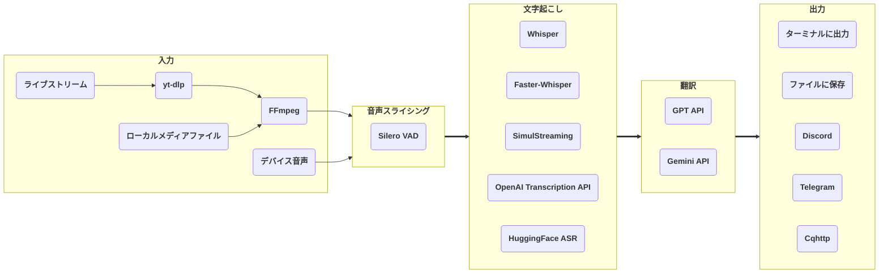

# stream-translator-gpt

[](https://badge.fury.io/py/stream-translator-gpt) [](https://pypi.org/project/stream-translator-gpt/) [](https://pepy.tech/project/stream-translator-gpt) [](https://github.com/ionic-bond/stream-translator-gpt/blob/main/LICENSE) [](https://gradio.app)

[**English**](./README.md) | [**中文**](./README_CN.md) | **日本語**

ライブストリーム・ローカルメディアファイル・デバイス音声のリアルタイム文字起こしと翻訳。コマンドラインツールと Gradio WebUI の 2 つの形態で利用できます。

## Colab でクイックスタート（推奨）

最も簡単な使い方です。ローカル環境の構築は不要で、Colab の性能で日常的に安定して使えます。必要なのは、使うサービスに応じた自分の API キーだけです：

- **Gemini API** で翻訳する場合：[**Google API** キーを作成](https://aistudio.google.com/app/apikey)（おすすめ。Gemini の **Flash-Lite** モデルには毎分 15 回・毎日 500 回の無料枠があります）
- **OpenAI Transcription API** で文字起こし、または **GPT API** で翻訳する場合：[**OpenAI API** キーを作成](https://platform.openai.com/api-keys)（**OpenAI 互換の API** も利用できます）

|                                                                                      コマンドライン                                                                                       |                                                                                     WebUI                                                                                     |
| :---------------------------------------------------------------------------------------------------------------------------------------------------------------------------------------: | :---------------------------------------------------------------------------------------------------------------------------------------------------------------------------: |
| [](https://colab.research.google.com/github/ionic-bond/stream-translator-gpt/blob/main/colab/command_line_JP.ipynb) | [](https://colab.research.google.com/github/ionic-bond/stream-translator-gpt/blob/main/colab/webui_JP.ipynb) |

> [!NOTE]
> API キーのスクレイピングと盗用が頻発しているため、試用 API キーは提供できません。ご自身の API キーをご記入ください。

## 仕組み


```mermaid
flowchart LR
    subgraph ga["`**入力**`"]
        direction LR
        aa("`**FFmpeg**`")
        ab("`**デバイス音声**`")
        ac("`**yt-dlp**`")
        ad("`**ローカルメディアファイル**`")
        ae("`**ライブストリーム**`")
        ac --> aa
        ad --> aa
        ae --> ac
    end
    subgraph gb["`**音声スライシング**`"]
        direction LR
        ba("`**Silero VAD**`")
    end
    subgraph gc["`**文字起こし**`"]
        direction LR
        ca("`**Whisper**`")
        cb("`**Faster-Whisper**`")
        cc("`**SimulStreaming**`")
        cd("`**OpenAI Transcription API**`")
        ce("`**HuggingFace ASR**`")
    end
    subgraph gd["`**翻訳**`"]
        direction LR
        da("`**GPT API**`")
        db("`**Gemini API**`")
    end
    subgraph ge["`**出力**`"]
        direction LR
        ea("`**ターミナルに出力**`")
        ee("`**ファイルに保存**`")
        ec("`**Discord**`")
        ed("`**Telegram**`")
        eb("`**Cqhttp**`")
    end
    aa --> gb
    ab --> gb
    gb ==> gc
    gc ==> gd
    gd ==> ge
```

- **入力**：[**yt-dlp**](https://github.com/yt-dlp/yt-dlp) がライブストリームから音声を抽出。ローカルメディアファイルや PC のデバイス音声にも対応。
- **音声スライシング**：[**Silero-VAD**](https://github.com/snakers4/silero-vad) に基づく動的しきい値スライシング。
- **文字起こし**：ローカルで [**Whisper**](https://github.com/openai/whisper) / [**Faster-Whisper**](https://github.com/SYSTRAN/faster-whisper) / [**SimulStreaming**](https://github.com/ufal/SimulStreaming) / [**HuggingFace ASR**](https://huggingface.co/models?pipeline_tag=automatic-speech-recognition)、またはリモートで [**OpenAI Transcription API**](https://platform.openai.com/docs/guides/speech-to-text) を利用。
- **翻訳**（オプション）：OpenAI の [**GPT API**](https://platform.openai.com/docs/overview) または Google の [**Gemini API**](https://ai.google.dev/gemini-api/docs)。
- **出力**：**ターミナル**に出力、**ファイル**に保存（**.srt** 字幕など）、または **Discord** / **Telegram** / **Cqhttp** に送信。

## ローカルインストール（上級者向け）

ローカルでの実行には Python 環境の経験がある程度必要です（特に Windows）。実質的に Colab と同様の環境を自分で構築することになります。迷ったら Colab を使ってください。

1. **Python** >= 3.10
2. **FFmpeg**（インストール済みならスキップ）：
   - Windows: `winget install ffmpeg`
   - Linux (Debian/Ubuntu): `sudo apt install ffmpeg`
3. **ローカル文字起こし**（Whisper / Faster-Whisper / SimulStreaming / HuggingFace ASR）を使う場合のみ — OpenAI Transcription API だけを使うなら不要：
   - [システムに **CUDA** をインストール](https://developer.nvidia.com/cuda-downloads)
   - [Python に **PyTorch**（CUDA 版）をインストール](https://pytorch.org/get-started/locally/)
   - **Faster-Whisper** を使う場合は [**cuDNN** を CUDA ディレクトリにインストール](https://developer.nvidia.com/cudnn-downloads)

その後、パッケージをインストールします：

```
pip install stream-translator-gpt -U
```

WebUI も含める場合：

```
pip install stream-translator-gpt[webui] -U
```

## 使い方

### WebUI

```
stream-translator-gpt-webui
```

表示されたローカル URL をブラウザで開いてください。CLI の全機能を画面上で利用でき、設定はプリセットとして保存できます。

### コマンドライン

```
stream-translator-gpt URL [OPTIONS]
```

**文字起こしバックエンド**（デフォルトはローカル **Whisper**）：

- ```stream-translator-gpt {URL} --language {入力言語}```
- **Faster-Whisper**: ```stream-translator-gpt {URL} --language {入力言語} --use-faster-whisper```
- **SimulStreaming**: ```stream-translator-gpt {URL} --language {入力言語} --use-simul-streaming```
- **Faster-Whisper** をエンコーダーとする **SimulStreaming**: ```stream-translator-gpt {URL} --language {入力言語} --use-simul-streaming --use-faster-whisper```
- **OpenAI Transcription API**: ```stream-translator-gpt {URL} --language {入力言語} --use-openai-transcription-api --openai-api-key {OpenAI キー}```
- **HuggingFace ASR** モデル（`pip install stream-translator-gpt[hf_asr]` が必要。Hugging Face Hub で `pipeline_tag` が `automatic-speech-recognition` のモデルのみ対応）: ```stream-translator-gpt {URL} --model {HF モデル名} --use-hf-asr```

**翻訳**（`--translation-prompt` を設定すると有効になり、記入した API キーに応じてプロバイダが選ばれます）：

- **Gemini** で翻訳: ```stream-translator-gpt {URL} --language {入力言語} --translation-prompt "{入力言語}から{出力言語}に翻訳" --google-api-key {Google キー}```
- **GPT** で翻訳: ```stream-translator-gpt {URL} --language {入力言語} --translation-prompt "{入力言語}から{出力言語}に翻訳" --openai-api-key {OpenAI キー}```
- **OpenAI Transcription API** と **Gemini** を同時に使用: ```stream-translator-gpt {URL} --language {入力言語} --use-openai-transcription-api --openai-api-key {OpenAI キー} --translation-prompt "{入力言語}から{出力言語}に翻訳" --google-api-key {Google キー}```

> [!TIP]
> 翻訳プロンプトはそのまま LLM に渡されるため、言語ペア以外の指示も書けます。API の利用枠に余裕があれば、配信者が誰か・何の配信かといった背景情報や用語の指定を加えると、翻訳の精度が上がり、文脈による音声認識の誤字修正もより確実になります。

**入力ソース**（ストリーム URL 以外）：

- **ローカル動画/音声ファイル**: ```stream-translator-gpt {ファイルパス} --language {入力言語}```
- **システム音声**（ループバック）: ```stream-translator-gpt device --language {入力言語}```
- **マイク**: ```stream-translator-gpt device --mic --language {入力言語}```

**出力先**（ターミナル以外）：

- **Discord**: ```stream-translator-gpt {URL} --language {入力言語} --discord-webhook-url {Discord webhook URL}```
- **Telegram**: ```stream-translator-gpt {URL} --language {入力言語} --telegram-token {Telegram トークン} --telegram-chat-id {Telegram チャット ID}```
- **Cqhttp**: ```stream-translator-gpt {URL} --language {入力言語} --cqhttp-url {Cqhttp URL} --cqhttp-token {Cqhttp トークン}```
- **.srt 字幕ファイル**（オフライン生成）: ```stream-translator-gpt {URL} --language {入力言語} --translation-prompt "{入力言語}から{出力言語}に翻訳" --google-api-key {Google キー} --no-show-transcribe-result --retry-if-translation-fails --output-timestamps --output-file-path ./result.srt```

## すべてのオプション

> [!NOTE]
> すべてのオプションはハイフンとアンダースコアのどちらでも指定できます（`--openai-api-key` = `--openai_api_key`）。
> すべてのブールオプションには、無効化用の `--no-*` 形式があります（例：デフォルトで有効な `--dynamic-vad-threshold` は `--no-dynamic-vad-threshold` で無効化できます）。

| オプション                         | デフォルト値                   | 説明                                                                                                                                                                                                                       |
| :--------------------------------- | :----------------------------- | :------------------------------------------------------------------------------------------------------------------------------------------------------------------------------------------------------------------------- |
| `URL`                              |                                | ストリームの URL。ローカルファイルパスを入力すると、そのファイルが入力として使用されます。「device」と入力すると、PC デバイスから入力を取得します。                                                                        |
| **全般オプション**                 |
| `--openai-api-key`                 |                                | GPT 翻訳 / OpenAI Transcription API を使う場合の OpenAI API キー。複数ある場合は "," で区切ると順番に使用されます。                                                                                                        |
| `--google-api-key`                 |                                | Gemini 翻訳を使う場合の Google API キー。複数ある場合は "," で区切ると順番に使用されます。                                                                                                                                 |
| `--openai-base-url`                |                                | OpenAI の API エンドポイントをカスタマイズ（GPT 翻訳と OpenAI 文字起こしに影響）。                                                                                                                                         |
| `--google-base-url`                |                                | Google の API エンドポイントをカスタマイズ（Gemini 翻訳に影響）。                                                                                                                                                          |
| `--no-verify-ssl`                  |                                | OpenAI / Google API と HuggingFace ダウンロードの TLS 証明書検証を無効化。API エンドポイントやプロキシが自己署名・無効な証明書を使う場合に。base URL のホストが IP アドレスの場合は自動的に無効化されます。                |
| `--proxy`                          |                                | 個別に設定されていないすべての --*-proxy オプションにプロキシを設定。http_proxy 環境変数も設定されます。                                                                                                                   |
| **入力オプション**                 |
| `--format`                         | ba/wa*                         | ストリームのフォーマットコード。yt-dlp にそのまま渡されます。`yt-dlp {url} -F` で利用可能なフォーマットの一覧を取得できます。                                                                                              |
| `--list-format`                    |                                | 利用可能なフォーマットを一覧表示して終了。                                                                                                                                                                                 |
| `--cookies`                        |                                | メンバー限定配信を開くために使用。yt-dlp にそのまま渡されます。                                                                                                                                                            |
| `--input-proxy`                    |                                | yt-dlp に HTTP/HTTPS/SOCKS プロキシを指定。例：http://127.0.0.1:7890。                                                                                                                                                     |
| `--device-index`                   |                                | 録音するデバイスの番号。未設定の場合はシステムデフォルトの録音デバイスを使用。                                                                                                                                             |
| `--list-devices`                   |                                | すべてのオーディオデバイス情報を表示して終了。                                                                                                                                                                             |
| `--device-recording-interval`      | 0.5                            | 録音間隔が短いほど遅延は低くなりますが、CPU 使用率が上がります。0.1〜1.0 の間を推奨。                                                                                                                                      |
| `--mic`                            |                                | システム音声（ループバック）の代わりにマイクを使用。                                                                                                                                                                       |
| **音声スライシングオプション**     |
| `--min-audio-length`               | 0.5                            | 音声スライスの最小長（秒）。                                                                                                                                                                                               |
| `--max-audio-length`               | 30.0                           | 音声スライスの最大長（秒）。                                                                                                                                                                                               |
| `--target-audio-length`            | 5.0                            | 動的無音しきい値が有効な場合（デフォルトで有効）、この長さに近くなるように音声をスライスします。                                                                                                                           |
| `--continuous-no-speech-threshold` | 1.0                            | この秒数の間無音が続くとスライスします。動的無音しきい値が有効な場合（デフォルトで有効）、実際のしきい値はこの値を基に動的に調整されます。                                                                                 |
| `--no-dynamic-no-speech-threshold` |                                | 動的無音しきい値を無効化（デフォルトで有効）。                                                                                                                                                                             |
| `--prefix-retention-length`        | 0.5                            | スライス時に保持するプレフィックス音声の長さ。                                                                                                                                                                             |
| `--vad-threshold`                  | 0.35                           | 範囲 0〜1。値が高いほど音声判定が厳しくなります。動的 VAD しきい値が有効な場合（デフォルトで有効）、しきい値はこの値を基に動的に調整されます。                                                                             |
| `--no-dynamic-vad-threshold`       |                                | 動的 VAD しきい値を無効化（デフォルトで有効）。                                                                                                                                                                            |
| **文字起こしオプション**           |
| `--model`                          | turbo                          | Whisper/Faster-Whisper/SimulStreaming のモデルサイズを選択。利用可能なモデルは[こちら](https://github.com/openai/whisper#available-models-and-languages)を参照。                                                           |
| `--language`                       | auto                           | ストリームで話されている言語。デフォルトは自動検出。利用可能な言語は[こちら](https://github.com/openai/whisper#available-models-and-languages)を参照。                                                                     |
| `--use-faster-whisper`             |                                | Whisper の代わりに Faster-Whisper を使用。--use-simul-streaming と併用すると、Faster-Whisper をエンコーダーとした SimulStreaming が使用されます。                                                                          |
| `--use-simul-streaming`            |                                | Whisper の代わりに SimulStreaming を使用。--use-faster-whisper と併用すると、Faster-Whisper をエンコーダーとした SimulStreaming が使用されます。                                                                           |
| `--use-openai-transcription-api`   |                                | ローカル Whisper の代わりに OpenAI Transcription API を使用。                                                                                                                                                              |
| `--use-hf-asr`                     |                                | HuggingFace ASR モデルを使用。`--model` でモデル ID を指定。`pip install stream-translator-gpt[hf_asr]` が必要。                                                                                                           |
| `--transcription-filters`          | emoji_filter,repetition_filter | 文字起こし結果に適用するフィルター（"," 区切り）。emoji_filter と repetition_filter を提供しています。                                                                                                                     |
| `--no-language-based-filter`       |                                | ASR 言語に基づく言語フィルターの自動有効化を無効化（デフォルトで有効）。現在、英語・中国語・日本語のフィルターを提供しています。                                                                                           |
| `--transcription-initial-prompt`   |                                | 文字起こし用の汎用プロンプトまたは用語集。形式："単語1, 単語2, 単語3, ..."。このテキストは常にモデルへのプロンプトに含まれます。                                                                                           |
| `--transcription-context`          |                                | 文字起こしにおけるコンテキスト（前の文）の伝播を有効化（デフォルトで無効）。                                                                                                                                               |
| **翻訳オプション**                 |
| `--gpt-model`                      | gpt-5.4-nano                   | OpenAI の GPT モデル名。gpt-5.4 / gpt-5.4-mini / gpt-5.4-nano / gpt-5.5 / gpt-5.6-luna                                                                                                                                     |
| `--gemini-model`                   | gemini-3.5-flash-lite          | Google の Gemini モデル名。gemini-3-flash-preview / gemini-3.1-flash-lite / gemini-3.5-flash / gemini-3.5-flash-lite / gemini-3.6-flash                                                                                    |
| `--translation-prompt`             |                                | 設定すると、GPT / Gemini API で結果テキストをターゲット言語に翻訳します（記入した API キーに応じて選択）。例：「日本語から中国語に翻訳」。プロンプトに背景情報（配信者が誰か、何の配信か）を加えると翻訳品質が向上します。 |
| `--translation-history-size`       | 3                              | LLM API 呼び出し時にコンテキストとして送信する過去の文字起こしの数。性能の低いモデルではコンテキスト無効（0）を推奨。                                                                                                      |
| `--translation-timeout`            | 10                             | GPT / Gemini の翻訳がこの秒数を超えた場合、その翻訳は破棄されます。                                                                                                                                                        |
| `--use-json-result`                |                                | LLM 翻訳で JSON 結果を使用。一部のローカルデプロイモデル向け。                                                                                                                                                             |
| `--retry-if-translation-fails`     |                                | 翻訳のタイムアウト/失敗時にリトライ。オフラインでの字幕生成に使用。                                                                                                                                                        |
| `--temperature`                    |                                | GPT/Gemini パラメータ。出力のランダム性を制御し、高いほど多様な結果になります。                                                                                                                                            |
| `--top-p`                          |                                | GPT/Gemini パラメータ。Nucleus サンプリングのしきい値。累積確率がこの値を超えるトークンのみが考慮されます。                                                                                                                |
| `--top-k`                          |                                | Gemini パラメータ。トークン選択を確率上位 K 個の候補に制限します。                                                                                                                                                         |
| `--prompt-cache-key`               |                                | GPT パラメータ。設定すると API 側でプロンプトキャッシュ最適化が有効になります。                                                                                                                                            |
| `--reasoning-effort`               |                                | GPT パラメータ。推論モデルの推論深度を制御。オプション：none / minimal / low / medium / high / xhigh。                                                                                                                     |
| `--verbosity`                      |                                | GPT パラメータ。レスポンスの詳細度を制御。オプション：auto / short / concise / detailed。                                                                                                                                  |
| `--service-tier`                   |                                | GPT パラメータ。処理の優先度を指定。オプション：auto / default / flex / priority。                                                                                                                                         |
| `--debug-mode`                     |                                | デバッグモードを有効化。翻訳呼び出しごとに LLM への送信メッセージと使用量情報を表示。                                                                                                                                      |
| `--processing-proxy`               |                                | Whisper/GPT API に HTTP/HTTPS/SOCKS プロキシを指定（Gemini は現在プログラム内でのプロキシ指定に非対応）。例：http://127.0.0.1:7890。                                                                                       |
| **出力オプション**                 |
| `--output-timestamps`              |                                | テキスト出力時にタイムスタンプを付加。                                                                                                                                                                                     |
| `--no-show-transcribe-result`      |                                | 文字起こし結果を非表示にする（デフォルトで表示）。                                                                                                                                                                         |
| `--output-file-path`               |                                | 設定すると、結果テキストをこのパスに保存します。                                                                                                                                                                           |
| `--cqhttp-url`                     |                                | 設定すると、結果テキストをこの Cqhttp サーバーに送信します。                                                                                                                                                               |
| `--cqhttp-token`                   |                                | Cqhttp のトークン。サーバー側で設定されていなければ記入不要。                                                                                                                                                              |
| `--discord-webhook-url`            |                                | 設定すると、結果テキストをこの Discord チャンネルに送信します。                                                                                                                                                            |
| `--telegram-token`                 |                                | Telegram ボットのトークン。                                                                                                                                                                                                |
| `--telegram-chat-id`               |                                | 設定すると、結果テキストをこの Telegram チャットに送信します。--telegram-token と併用してください。                                                                                                                        |
| `--output-proxy`                   |                                | Cqhttp/Discord/Telegram に HTTP/HTTPS/SOCKS プロキシを指定。例：http://127.0.0.1:7890。                                                                                                                                    |

## 連絡先

Telegram: [@ionic_bond](https://t.me/ionic_bond)

## 寄付

[PayPal で寄付](https://www.paypal.com/donate/?hosted_button_id=D5DRBK9BL6DUA) または [PayPal](https://paypal.me/ionicbond3)
